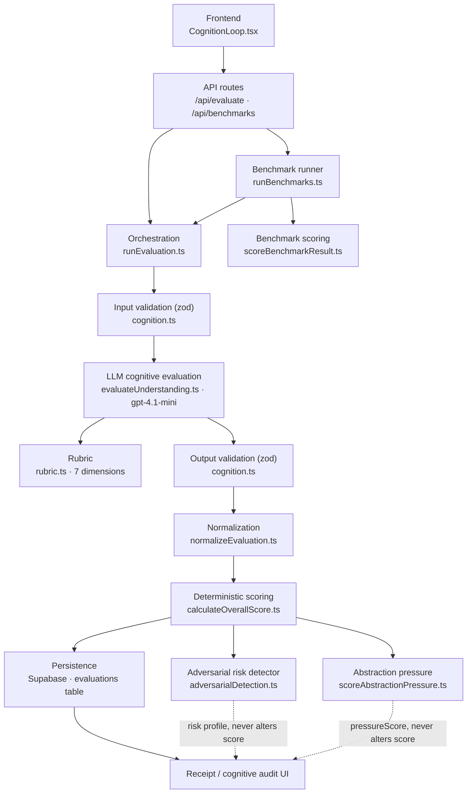

# OCII

[](https://github.com/yiyaw-lab/ocii/actions/workflows/ci.yml)
[](LICENSE)

**Open Cognitive Integrity Infrastructure** — a research platform for evaluating genuine human understanding rather than fluent AI-assisted output.

---

## What It Does

OCII takes a free-text response to a concept prompt and evaluates it across seven cognitive dimensions using an LLM rubric. Dimension scores feed into a deterministic weighted scoring pipeline. The overall score is computed without LLM involvement — separating evaluator judgment from aggregation to limit hallucinated percentages and inconsistency drift.

A second-stage adversarial detector then inspects the response for signals that a high score may reflect surface fluency — paraphrase, hallucinated specifics, vague jargon, or transfer bluffing — rather than genuine understanding. Its risk scores are reported alongside the receipt and never alter the understanding score.

---

## How It Works

A response flows through a single orchestration boundary (`runEvaluation`) that keeps LLM judgment, schema validation, normalization, and deterministic scoring as separate stages — so model output never computes the final percentage. Two independent second-stage detectors (adversarial risk, abstraction pressure) inspect the result without ever altering the understanding score. A benchmark harness evaluates the evaluator itself.



---

## Cognitive Dimensions

| Dimension | What it measures |
|---|---|
| Conceptual Accuracy | Whether the core idea is correctly represented |
| Mechanistic Reasoning | Whether the learner explains how/why, not just what |
| Abstraction & Compression | Whether the learner can generalize beyond original wording |
| Transfer Capability | Whether the concept applies in a novel context |
| Retrieval Robustness | Whether the learner reconstructs rather than recognizes |
| Metacognitive Calibration | Whether confidence aligns with demonstrated understanding |
| Epistemic Awareness | Whether the learner understands the concept's boundaries and assumptions |

---

## Evaluation Pipeline

```
User Input
→ EvaluationInputSchema        (zod validation)
→ runEvaluation
→ evaluateUnderstanding        (LLM rubric, quick or full mode)
→ EvaluationOutputSchema       (zod validation)
→ normalizeEvaluation          (normalize raw LLM output)
→ calculateOverallScore        (deterministic weighted aggregation)
→ saveEvaluation               (Supabase persistence)
→ render receipt / audit UI
```

**Quick mode** evaluates a subset of dimensions. **Full mode** evaluates all seven. Quick mode reduces latency; full mode is used for benchmarking and research.

---

## Adversarial Risk Detection

After an evaluation completes, a deterministic second-stage detector inspects the response and the evaluator's own scores for signals that a high score may reflect fluent output rather than genuine understanding. It runs with no extra network calls and **never modifies `overallUnderstandingScore`** — it produces a separate risk profile for human review.

Six independent signals are scored in `[0, 1]`:

| Signal | Fires when |
|---|---|
| Fluency risk | High score backed by sparse or very short evidence |
| Paraphrase risk | High lexical (unigram + bigram) overlap with the source text |
| Hallucination risk | Confident specific claims paired with low mechanistic reasoning, or named entities absent from the source |
| Transfer bluff risk | Claims of cross-domain application without mechanism-bridging language |
| Vague jargon risk | Dense academic vocabulary with no causal connectors |
| Causal inversion risk | Conceptual accuracy far exceeds mechanistic score, with sequential framing of a concurrent process |

Overall adversarial risk is `max(subscores)`, so one strong signal is never diluted by quiet ones. Scores at or above `0.40` surface a warning; `0.70+` is treated as high risk. Each result also returns a recommended **pressure test** — a targeted follow-up question aimed at the strongest signal.

The `/api/evaluate` response carries an `adversarialDetection` object, and the receipt UI shows a risk banner above the audit when overall risk ≥ 0.40. An optional LLM-assisted refinement (`detectAdversarialRiskWithLLM`) sharpens the causal-inversion signal only when the heuristic is ambiguous.

---

## Benchmark System

OCII includes a benchmark harness for evaluating the evaluator itself.

```
GET /api/benchmarks
```

Returns per-case results and a top-level `allPassed` field. Each benchmark case specifies:

- Expected score range
- Expected strong and weak dimensions
- Pass/fail consistency threshold
- Latency expectation
- Abstraction pressure detection (for `abstraction_pressure` cases — see below)

Run benchmarks to detect evaluator drift, calibration shifts, or regressions after rubric or model changes.

Benchmark cases are grouped into five categories:

| Category | What it tests |
|---|---|
| `strong_understanding` | Evaluator correctly scores genuine multi-dimensional understanding high |
| `surface_paraphrase` | Evaluator behavior when the explanation is a near-verbatim copy of the source |
| `confident_but_wrong` | Evaluator correctly identifies confident misconceptions |
| `good_recall_weak_transfer` | Evaluator penalizes lack of transfer while rewarding retrieval |
| `abstraction_pressure` | Pressure scorer correctly detects paraphrase/evasion when source is absent |

For `abstraction_pressure` cases: a benchmark **PASS** means the pressure scorer correctly caught a low-quality response. The expected pressure score range is low (≤50) because the scripted response is intentionally bad. Low pressureScore = detector working, not learner succeeding.

---

## Abstraction Pressure Testing

Standard rubric evaluation has access to the source material. This creates a structural limitation: a learner who copies the definition and a learner who genuinely understands it produce explanations that score nearly identically on accuracy, mechanistic reasoning, and retrieval — because the definition itself encodes the mechanism. Paraphrase inherits correctness for free.

Abstraction pressure tests are a second-stage signal designed to break this symmetry.

### How it works

1. After full-mode evaluation, the evaluator generates one **abstraction pressure challenge** — a question that cannot be answered by restating the definition.
2. The challenge requires one of: **analogy** (from a different domain), **transfer** (novel application with explicit role mapping), **compression** (essential logical structure in different words), or **reframing** (explain to a skeptic or non-expert).
3. The learner responds to the challenge.
4. A separate scorer evaluates the response. **The pressure scorer does not receive the source material.** This prevents paraphrase from inheriting the definition's correctness.

### pressureScore

pressureScore (0–100) measures whether the challenge was genuinely met:

- **High (≥60):** evidence of genuine abstraction, transfer, or compression — structural knowledge the definition alone cannot supply
- **Low (≤40):** challenge evasion — definition restated, borrowed sophistication without substance, or vague philosophical language that ignores the specific ask

A high overall evaluation score paired with a low pressureScore indicates the original explanation may have been inflated by surface fluency.

---

## Setup

```bash
npm install
npm run dev
```

Required environment variables:

```
OPENAI_API_KEY=
NEXT_PUBLIC_SUPABASE_URL=
SUPABASE_SERVICE_ROLE_KEY=
```

Place these in `.env.local` (gitignored).

### Development

```bash
npm test            # unit + scoring suite (vitest)
npm run benchmark   # benchmark suite (needs the dev server running)
npm run lint        # eslint
```

---

## API

| Endpoint | Method | Description |
|---|---|---|
| `/api/evaluate` | POST | Run an evaluation on a concept + response |
| `/api/benchmarks` | GET | Run the benchmark suite |
| `/history` | GET | View past evaluations (backward-compatible with v0 and v1 schema) |

---

## Database Schema

Evaluations are persisted to Supabase. The schema evolved from a flat v0 score format to a rubric v1 JSONB format. The `/history` route handles both.

---

## Known Limitations

- Evaluator latency: ~10–30s depending on mode and model
- Benchmark case coverage is small; calibration is experimental
- Evaluator variance across runs is under active investigation
- Quick and full mode benchmark thresholds are not yet separately defined
- Quick mode cannot reliably detect paraphrase — it lacks enough structural signal
- Abstraction pressure testing is a second-stage interaction: it needs a learner response to the generated challenge before a `pressureScore` is available

---

## Research Directions

- Evaluator variance modeling and consistency scoring
- Longitudinal cognition tracking across sessions
- Ensemble evaluators with disagreement analysis
- Transfer graphs linking concepts by structural similarity
- Retrieval robustness measurement over time

---

## License

Licensed under the Apache License 2.0. See [LICENSE](LICENSE).

Copyright 2026 Coaur Inc.
